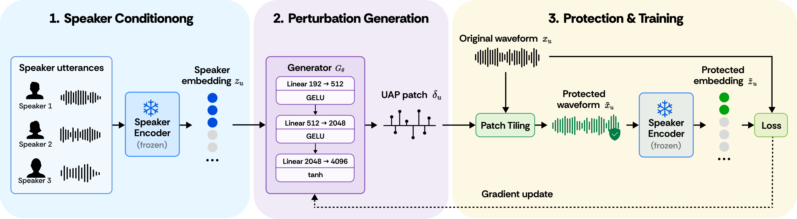

# SUPER: Speaker-Conditioned Universal Perturbation Generator against Unauthorized Voice Cloning

SUPER protects a person's voice recordings from unauthorized zero-shot voice
cloning. A lightweight generator network is conditioned on a target speaker's
embedding and emits a short adversarial audio patch; tiling that patch across
a recording (at an inaudible SNR) is enough to make voice-cloning systems
produce speech that no longer matches the true speaker — **without any
per-recording optimization at protection time**. A single forward pass through
the generator (~0.2ms) replaces the iterative gradient-descent attack that
prior universal-perturbation methods require per speaker.

The generator is trained against an ensemble of four independently-trained
speaker-embedding models (**Zonos**, **CAM++**, **YourTTS's speaker encoder**,
**ECAPA-TDNN**) using **MLDG** (meta-learning for domain generalization) so
that the perturbation transfers to voice-cloning systems it never saw during
training. This repo evaluates transfer against 10 independent voice-cloning
systems: 3 (Zonos, YourTTS, CosyVoice2) share a speaker encoder with the
training ensemble, the other 7 are fully black-box.

This is a trimmed, portfolio-oriented copy of the full research repository:
it keeps the final model's training/protection/evaluation pipeline and
results, not every ablation and one-off experiment script from the project's
development history.

## 🧭 Overview



## 📊 Results

**Defense success rate (DSR)** — fraction of protected recordings whose
voice-clone no longer matches the true speaker under an ECAPA-TDNN or ResNet
speaker verifier at its EER operating point (higher is better; **Orig.** =
unprotected recording, **Enkidu** = per-speaker optimization-based UAP
baseline, **Ours** = SUPER, single forward pass, no per-speaker
optimization). Bold = best of the three per system/verifier:

<table>
<thead>
<tr><th></th><th colspan="3">Zonos</th><th colspan="3">CosyVoice2</th><th colspan="3">YourTTS</th><th colspan="3">Chatterbox</th><th colspan="3">Qwen3-TTS</th></tr>
<tr><th>ASV</th><th>Orig.</th><th>Enkidu</th><th>Ours</th><th>Orig.</th><th>Enkidu</th><th>Ours</th><th>Orig.</th><th>Enkidu</th><th>Ours</th><th>Orig.</th><th>Enkidu</th><th>Ours</th><th>Orig.</th><th>Enkidu</th><th>Ours</th></tr>
</thead>
<tbody>
<tr><td>ECAPA-TDNN</td><td>0.02</td><td>0.11</td><td><b>0.85</b></td><td>0.09</td><td>0.57</td><td><b>0.73</b></td><td>0.15</td><td>0.21</td><td><b>0.99</b></td><td>0.05</td><td>0.24</td><td><b>0.81</b></td><td>0.02</td><td>0.60</td><td><b>0.70</b></td></tr>
<tr><td>ResNet</td><td>0.00</td><td>0.06</td><td><b>0.91</b></td><td>0.07</td><td>0.46</td><td><b>0.74</b></td><td>0.05</td><td>0.10</td><td><b>0.90</b></td><td>0.03</td><td>0.23</td><td><b>0.81</b></td><td>0.01</td><td>0.59</td><td><b>0.63</b></td></tr>
</tbody>
</table>

<table>
<thead>
<tr><th></th><th colspan="3">GPT-SoVITS</th><th colspan="3">StyleTTS2</th><th colspan="3">XTTS-v2</th><th colspan="3">Spark-TTS</th><th colspan="3">Dia-1.6B</th></tr>
<tr><th>ASV</th><th>Orig.</th><th>Enkidu</th><th>Ours</th><th>Orig.</th><th>Enkidu</th><th>Ours</th><th>Orig.</th><th>Enkidu</th><th>Ours</th><th>Orig.</th><th>Enkidu</th><th>Ours</th><th>Orig.</th><th>Enkidu</th><th>Ours</th></tr>
</thead>
<tbody>
<tr><td>ECAPA-TDNN</td><td>0.13</td><td><b>0.76</b></td><td>0.72</td><td>0.28</td><td><b>0.76</b></td><td>0.68</td><td>0.23</td><td>0.54</td><td><b>0.74</b></td><td>0.05</td><td>0.45</td><td><b>0.81</b></td><td>0.37</td><td>0.83</td><td><b>0.93</b></td></tr>
<tr><td>ResNet</td><td>0.16</td><td>0.73</td><td><b>0.74</b></td><td>0.28</td><td><b>0.80</b></td><td>0.73</td><td>0.08</td><td>0.39</td><td><b>0.68</b></td><td>0.06</td><td>0.40</td><td><b>0.93</b></td><td>0.34</td><td>0.80</td><td><b>0.94</b></td></tr>
</tbody>
</table>

Ours is the best defense in 17 of these 20 system×verifier cells across all
10 voice-cloning systems, and stays within a few points of Enkidu on the
remaining 3 (StyleTTS2, GPT-SoVITS ResNet) — see `paper/SUPER.tex` for the
full breakdown and discussion of the mixed StyleTTS2 result.

**MLDG ablation** — average DSR before/after adding the meta-learning
(domain-generalization) objective to training, held out to systems never
seen during training:

| Model | w/o MLDG | w/ MLDG | Δ |
|---|---|---|---|
| CosyVoice2 | 0.67 | **0.73** | **+0.06** |
| Zonos | 0.80 | **0.85** | **+0.05** |
| YourTTS | 0.89 | **0.98** | **+0.09** |

**Robustness to post-processing** (GPT-SoVITS, n=118) — DSR after the
protected recording is passed through common audio transforms before
cloning:

| Post-processing | ECAPA-TDNN | ResNet |
|---|---|---|
| Clean (no processing) | 0.881 | 0.898 |
| Frequency filtering | 0.881 | 0.932 |
| 8-bit quantization | 0.915 | 0.907 |
| Downsampling to 8 kHz | 1.000 | 1.000 |
| Denoising (VoiceFixer) | 0.703 | 0.686 |

The defense is robust to filtering, quantization, and downsampling (DSR
stays ≥0.88, and downsampling drives it to 1.0), and degrades gracefully
under aggressive ML-based denoising rather than collapsing.

**Efficiency** (deployment-time cost, no gradient computation needed once the
generator is trained):

| Stage | Cost |
|---|---|
| Speaker-embedding extraction (3 reference clips, one-time per speaker) | 0.123 s |
| UAP generation (one forward pass) | 0.0002 s |
| Applying the perturbation to a 4s clip | 0.00025 s → real-time factor **0.000064** |

## 🏗️ Architecture

- `models/generator.py` — `WaveformUAPGenerator`: takes the concatenated
  four-encoder speaker embedding (1024-d) and emits a fixed-length waveform
  patch.
- `models/campplus_native.py` — a native PyTorch reimplementation of CAM++
  (one of the four speaker encoders), including a fix for a NaN-gradient bug
  in the original ONNX-traced version (a variance computed as `E[x²]-E[x]²`
  goes slightly negative under float cancellation on near-silent input,
  before the final `Sqrt` — clamped to `1e-12` here).
- `audio/tiler.py` — `WaveformTiler`: tiles the generated patch across an
  arbitrary-length recording at a target SNR (inaudibility constraint).
- `train_ensemble_full4_mldg.py` — trains the generator against the 4-encoder
  ensemble with an MLDG meta-learning objective for cross-system transfer.
- `protect_ensemble_full4.py` — applies a trained generator to a directory of
  speakers' recordings.
- `eval_zonos_only.py` — example black-box evaluation script: clones a
  protected/unprotected reference through a victim TTS system and measures
  the true-speaker cosine similarity via independent verifiers. The other 8
  TTS systems in the results table above use the same pattern against their
  own SDKs/APIs (not all included in this trimmed repo — see the paper for
  full methodology).

## ⚙️ Setup

Each TTS victim system needs its own conda environment due to conflicting
dependency pins; this repo ships `pip freeze` snapshots for the two
environments needed to run the included scripts:

```bash
conda create -n TTS python=3.9 && conda activate TTS
pip install -r environment/requirements-TTS.txt

conda create -n zonos python=3.10 && conda activate zonos
pip install -r environment/requirements-zonos.txt
```

You'll also need:
- [Zonos](https://github.com/Zyphra/Zonos) (Apache-2.0) — `git clone` and
  `checkout bc40d98`, then update `zonos_root` in `config.py` and the path in
  `eval_zonos_only.py`.
- A VoxCeleb1 copy for training (`voxceleb1_root` in `config.py`).

See `THIRD_PARTY_NOTICES.md` for the full dependency list.

## 🚀 Usage

```bash
# 1. Train the generator against the 4-encoder MLDG ensemble
conda activate TTS
python train_ensemble_full4_mldg.py --epochs 500 --gpu 0 --speakers_per_batch 16

# 2. Apply the trained generator to a directory of speakers
python protect_ensemble_full4.py --ckpt checkpoints/ensemble_full4_mldg/generator_latest.pt

# 3. Evaluate black-box transfer against a victim TTS system
conda activate zonos
python eval_zonos_only.py --prot_root <protected_dir> --orig_root <original_dir>
```

## 📄 Paper

`paper/SUPER.tex` has the full methodology, all 10 systems' results,
ablations, and the MLDG training details.

## 📜 License

MIT (this repository's own code) — see `LICENSE` and `THIRD_PARTY_NOTICES.md`
for dependencies.
